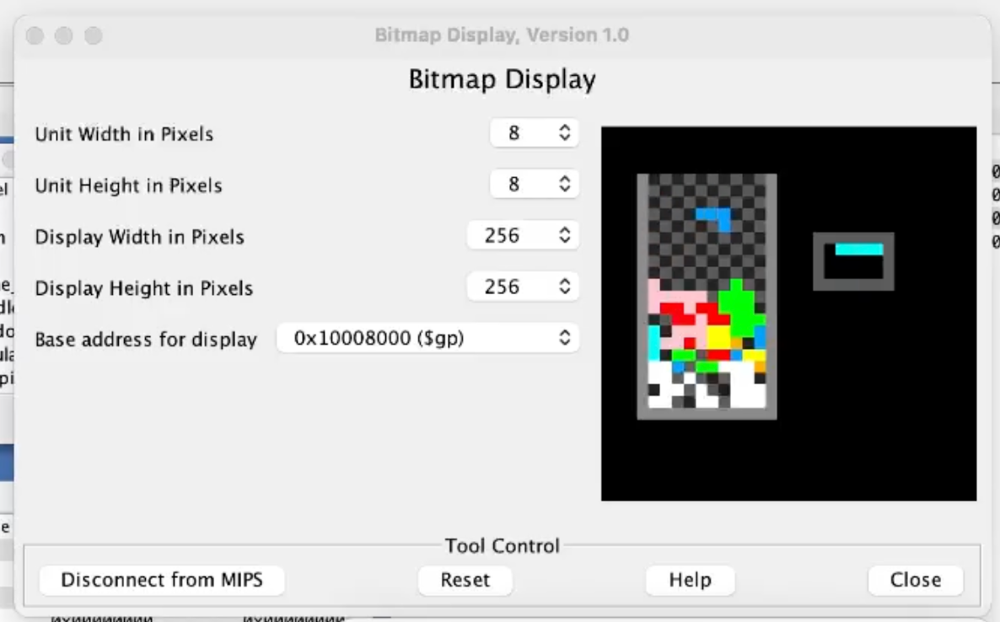

# Tetris in MIPS Assembly

A complete, playable Tetris written in ~2,600 lines of hand-written MIPS assembly, running
on a bare simulator with no standard library, no operating system, and no graphics API.
Every pixel on screen is a 32-bit word stored directly into a memory-mapped framebuffer.

Built for CSCB58 (Computer Organization) at the University of Toronto Scarborough. Graded 100%.

**[Video demo](https://www.youtube.com/watch?v=VnhEV3i1An4)** · **[Design document](High%20level%20design.md)**

---

## What's interesting about it

The constraints are the point. On this target there is no `printf`, no `malloc`, no
framebuffer library, and no timer interrupt:

- **Rendering** bottoms out in one instruction. `paint_unit(row, col, colour)` computes
  `0x10008000 + (row * 32 + col) * 4` and stores a word. Walls, the checkerboard grid,
  falling pieces, the line-clear flash, and the game-over lettering are all loops around
  that single store.
- **Input** is polled from two memory-mapped registers. There is no blocking read and no
  key-up event, so the game loop samples the keyboard once per tick and clears the key
  after dispatch.
- **Gravity** has no clock to read. It's an accumulator: a counter grows by `gravity_step`
  every iteration and synthesises a "move down" input when it crosses a threshold. Raising
  `gravity_step` every five cleared lines is the entire difficulty curve.
- **Rotation** uses no trigonometry and no matrices. Each tetromino is a static table of
  four `(dx, dy)` cell offsets per orientation; rotating is an increment on an index.
- **Collision is speculative.** The engine computes where the piece *would* land, tests
  all four cells, and only then mutates state, so there is no rollback path anywhere in
  the codebase.
- **The font is hand-built.** The game-over screen renders from a 5×7 bitmap font stored
  as 7 bytes per glyph, one row per byte in the low 5 bits.

The [Design document](High%20level%20design.md) covers the architecture, the data model, and a candid
list of what I'd rewrite.

---

## Features

**Gameplay**
- All 7 tetrominoes, each with its own colour and correct orientation count (O: 1, I/S/Z: 2, T/L/J: 4)
- Wall and piece-to-piece collision detection
- Line clearing with cascading shift-down, correct for simultaneous multi-line clears
- Gravity that accelerates every 5 cleared lines
- Randomised partially-filled starting rows, so the board is never empty at spawn

**Presentation**
- Next-piece preview panel
- Red/white flash animation on completed lines
- Sound effects (MIDI syscall) for line clears, blocked moves, and game over
- Pixel-rendered `GAME OVER` screen driven by a hand-built bitmap font

---

## Running it

Requires [MARS](http://courses.missouristate.edu/kenvollmar/mars/) (MIPS Assembler and
Runtime Simulator), version 4.5 or later.

1. Open `tetris.asm` in MARS.
2. Open **Tools → Bitmap Display** and configure:

   | Setting | Value |
   |---|---|
   | Unit width | 8 px |
   | Unit height | 8 px |
   | Display width | 256 px |
   | Display height | 256 px |
   | Base address | `0x10008000` (`$gp`) |

   Click **Connect to MIPS**.
3. Open **Tools -> Keyboard and Display MMIO Simulator** and click **Connect to MIPS**.
4. Assemble (F3) and run (F5). Keyboard input goes into the MMIO simulator window, not the
   main MARS window.

### Controls

| Key | Action |
|---|---|
| `A` | Move left |
| `D` | Move right |
| `S` | Soft drop |
| `W` | Rotate |
| `Q` | Quit |

Uppercase and lowercase are both accepted.

---

## Structure

Single file, organised top to bottom as constants → data → text.

| Section | Contents |
|---|---|
| Constants | Geometry, colours, hardware addresses, shape and action codes |
| Data | `.board` (colours) and `.board_occupied` (collision flags), piece state, tetromino offset tables, bitmap font |
| Game loop | `main`, `game_loop`, `handle_input`, `update_piece`, `handle_gravity` |
| Piece logic | `spawn_piece_center`, `move_piece_*`, `rotate_piece`, `lock_piece`, `load_piece` |
| Collision | `wall_collision`, `occupancy_collision`, and their per-coordinate predicates |
| Line clearing | `clear_lines`, `scan_row`, `shift_down`, `clear_line_animation` |
| Rendering | `paint_unit`, `paint_cell`, `render_board`, `draw_walls`, `draw_grid`, `draw_panel`, `draw_game_over` |

---

## Known limitations

- Gravity is tied to loop iterations rather than wall-clock time, so fall speed depends on
  simulator throughput.
- Rotation is rejected on collision rather than wall-kicked.
- No hard drop, hold queue, on-screen score, or restart from the game-over screen.
- Debug output prints to the console on every blocked move.

These and the structural issues I'd fix, especially eight duplicated copies of the same shape-dispatch chain.

More details are written in the [Design document](High%20level%20design.md).
